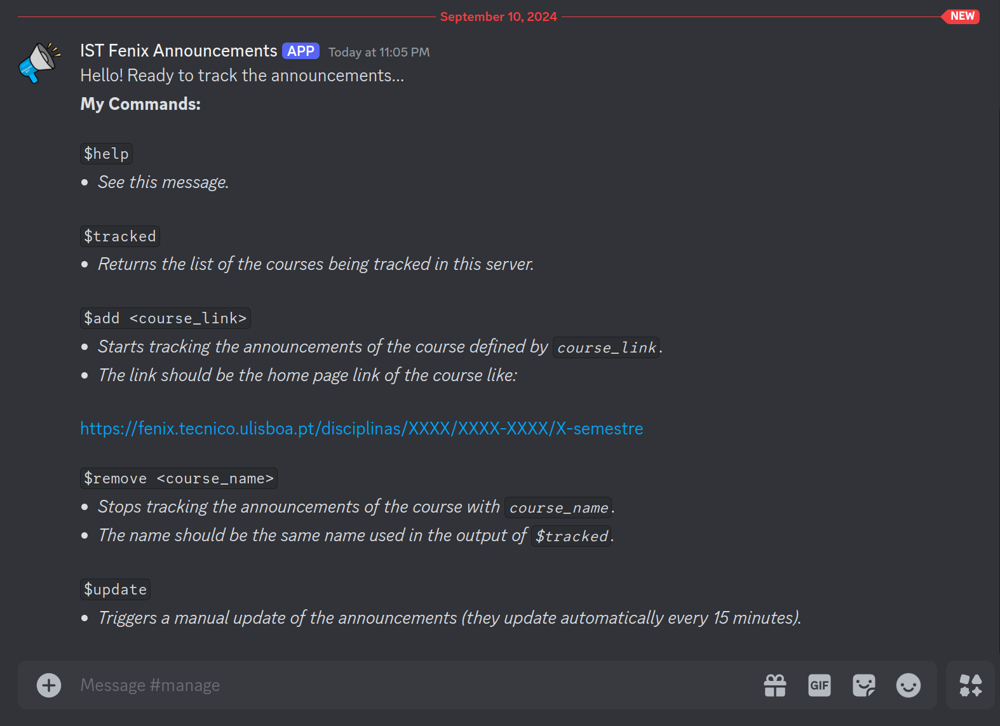

# IST Announcements Bot

## What is it?

Announcements in Fenix require the student to manually check each course for new announcements or updates, so this is a Discord bot that does both and notifies the student automatically.

## How can I replicate the bot creation process?

Follow these steps:

1. Create a discord server.
2. Create the discord application in the [developer portal](https://discord.com/developers/applications).
3. Go to `Bot` and turn on `Message Content Intent`.
4. Extract the token by clicking on `Reset Token` and create a `.env` file in the root folder of the project with the token. For example: `BOT_TOKEN="SOME_TOKEN_HERE"`.
5. Go to `OAuth2`, then on `OAuth2 URL Generator` select `bot`. Now, in `Bot Permissions` select: `Manage Channels` and `Send Messages`. Finally, copy and paste the generated URL on the browser, adding the bot to the desired server.
6. Run `main.py` after activating the virtual environment with `pipenv`.

## Available commands

- `$help`: _See the help message._

- `$tracked`: _Returns the list of the courses being tracked in the server._

- `$add <course_link>`: _Starts tracking the announcements of the course defined by `course_link`. The link should be the home page link of the course like:_ https://fenix.tecnico.ulisboa.pt/disciplinas/XXXX/XXXX-XXXX/X-semestre

- `$remove <course_name>`: _Stops tracking the announcements of the course with `course_name`. The name should be the same name used in the output of `$tracked`._

- `$update`: _Triggers a manual update of the announcements (they update automatically every `UPDATE_INTERVAL` minutes)._

## Example

